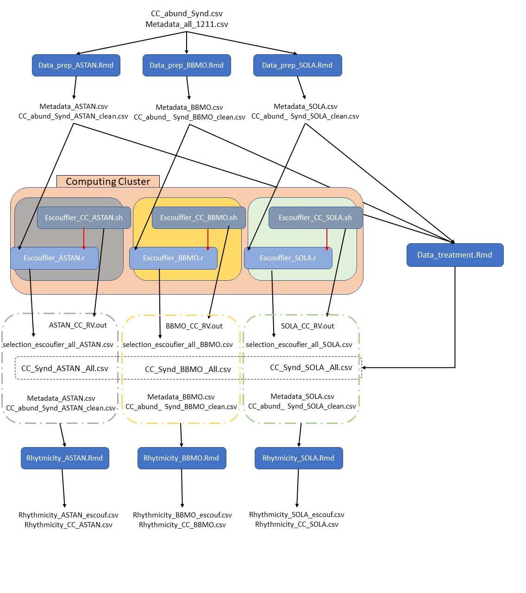

## Spatial analysis, files list:
* ### Spatial_expl.Rmd : 
All the steps required for the analyses are included in the Rmarkdown document.

Input: /SSN/Split_Igraph_Synd_id100_cov80.z01-3

Output: graphical representations and /Supplementary/Table_S5_jaccard.csv

* ### Metadata_RDA.csv: 

The environmental parameters included in the RDA analysis.

* ### Anova_RDA.sh and Rscript_Anova_RDA.R:

The statistical significance of the Redundancy Analysis (RDA) was tested with an ANOVA at two levels, the global RDA and each RDA axis. 
For the global RDA the ANOVA was run through Rstudio and the commands are included in the Rmd lines 832-842.

For each RDA axis the computational ressources required are greater and was run with Rscript_Anova_RDA.R was run on ABiMs cluster through the bash script Anova_RDA.sh. The results of the ANOVA are pasted in the Rmd (lines 852-874).

## Temporal analysis, files list:

* ### Step 1: TimeSeries_CC.Rmd, Data_Prep.Rmd

Extraction of Syndiniales abundance tables in time-series (TS) clusters.
Input: /SSN/Split_Igraph_Synd_id100_cov80.z01-3, /Metadata/Metadata_all_1211.csv
Output: CC_abund_Synd_[TS name]_clean.csv, Metadata_[TS name].csv

* ### Step 2: Data_treatment.Rmd

Input: CC_abund_[TS name]_clean.csv, Metadata_[TS name].csv
Output: CC_Synd_[TS name]_All.csv

* ### Step 3: Escoufier_[TS name].r

Input: CC_abund_[TS name]_clean.csv
Output: Table_S1_escoufier.csv

Scripts are demanding in computation power and were run on a cluster via the bash scripts: Escouffier_CC_[TS name].sh
Output: [TS name]_CC_RV.out

* ### Step 4: Rythmicity_[TS name].Rmd

Input: [TS name]_CC_RV.out, Table_S1_escoufier.csv, CC_Synd_[TS name]_All.csv, Metadata_[TS name].csv, CC_abund_Synd_[TS name]_clean.csv
Output: Table_S2_rythmic.csv, Table_S3_escoufier_rythmic.csv

For BBMO time-series, the Rscript was run on the cluster via: Rythmicity_batch_CC_BBMO.sh

*Correspondance with scheme:*
*CC_Synd_[TS name] _All.csv --> Table_S1_escoufier.csv*
*Rhythmicity_CC_[TS name].csv --> Table_S2_rythmic.csv*
*Rhythmicity_[TS name]_escouf.csv --> Table_S3_escoufier_rythmic.csv*

* ### Step 5: Dataset.Rmd and Heatmap.py

These scripts were used to do the final graphical representation of the above analysis: the first to extract the relevant data and second to plot it.
